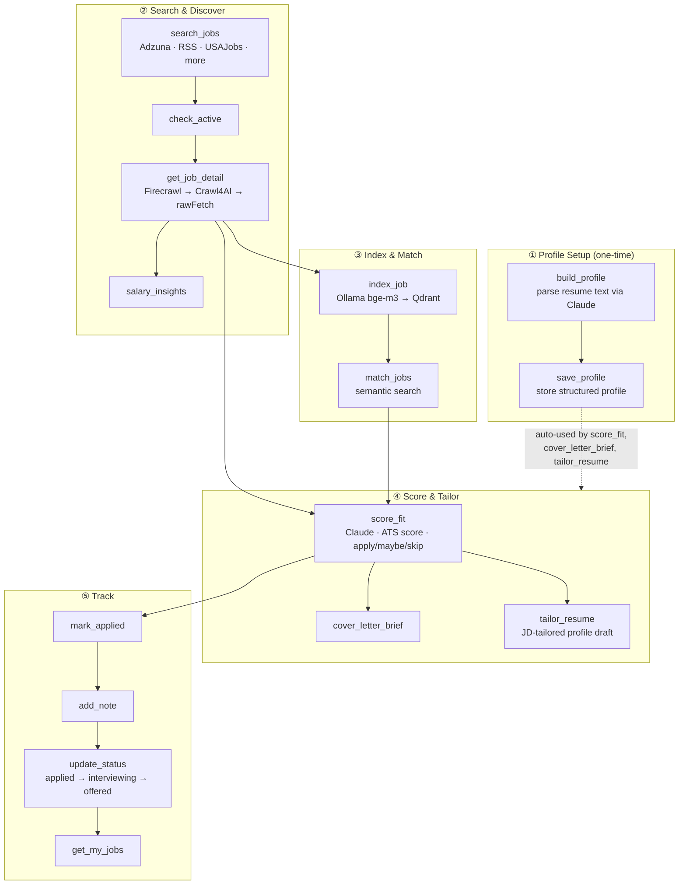
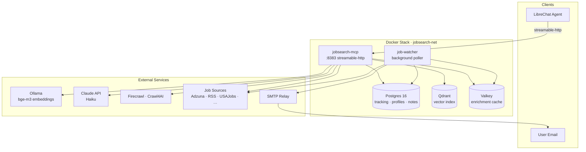

# jobsearch-mcp

[](https://claude.ai/code)
[](https://github.com/TadMSTR/jobsearch-mcp/actions/workflows/ci.yml)
[](https://opensource.org/licenses/MIT)

A self-hosted MCP server that turns a LibreChat agent into a full job search assistant — from searching across multiple boards, to building and storing a resume profile, to scoring fit against listings, to tracking applications through a pipeline. Built with FastMCP for multi-user LibreChat deployments.

**Search** across Adzuna, Remotive, WeWorkRemotely, Jobicy, USAJobs, and more. **Enrich** listings with full job descriptions via a multi-tier extraction pipeline. **Profile** your resume once and every scoring and tailoring tool uses it automatically. **Score** fit with a structured Claude-powered breakdown including ATS analysis. **Match** jobs semantically against your profile. **Track** the full pipeline per user in Postgres. **Watch** for new matches in the background and get email alerts.

Most job search MCP tools do one thing — scrape listings or generate cover letters. This one connects the entire workflow so an agent can drive it end-to-end.

Built with [Claude Code](https://claude.ai/code) using the multi-agent workflow from [homelab-agent](https://github.com/TadMSTR/homelab-agent).

---

## How It Works



You don't have to use every step — an agent can search and score without ever touching the tracker, or use the tracker standalone for jobs found elsewhere.

---

## Architecture



---

## Tools

### Resume Profile

Build and store your profile once — `score_fit`, `cover_letter_brief`, and `tailor_resume` all use it automatically when no resume is passed explicitly.

| Tool | Description |
|------|-------------|
| `build_profile` | Parse raw resume or bio text into a structured profile using Claude. Returns the result for review — does not auto-save. |
| `save_profile` | Store the structured profile. All scoring and tailoring tools use it automatically from this point. |
| `get_profile` | Retrieve your stored profile. |
| `delete_profile` | Remove your stored profile and associated data. |
| `tailor_resume` | Rewrite your stored profile's highlights and summary to match a specific JD. Returns the tailored version for review — does not overwrite your stored profile. |

### Search & Discovery

| Tool | Description |
|------|-------------|
| `search_jobs` | Search across Adzuna, Remotive, WeWorkRemotely, Jobicy, and USAJobs (default). Supports `query`, `location`, `remote_only`, and `sources` params. **Optional sources:** `findwork`, `themuse` (tech/culture-focused), `indeed`, `glassdoor`, `ziprecruiter` (scraping-based via python-jobspy, not included by default). |
| `get_job_detail` | Fetch a full job description from a URL. Uses a multi-tier enrichment pipeline: Firecrawl → Crawl4AI → rawFetch. Results are cached in Valkey. |
| `check_active` | Check whether a listing is still active. Returns `active=True/False/None` and the signal that triggered it. |
| `salary_insights` | Salary intelligence for a role — min/max/avg/median from live listings, a distribution histogram, and a monthly trend. Powered by Adzuna. |

### Vector Search & Matching

| Tool | Description |
|------|-------------|
| `index_job` | Fetch a job and store it in Qdrant using Ollama bge-m3 embeddings. Call this on listings worth tracking. |
| `match_jobs` | Find indexed jobs semantically similar to a resume or free-text description. Supports `top_k` and `exclude_seen` params. |

### Fit Scoring & Application Prep

| Tool | Description |
|------|-------------|
| `score_fit` | Score how well a resume matches a job. Fetches the full JD, then uses Claude to return matched skills, missing skills, nice-to-haves met, seniority fit, ATS score (0–100), and an `apply/maybe/skip` recommendation. Uses stored profile if no resume is passed. |
| `cover_letter_brief` | Structured cover letter writing guide — opening angle, requirements mapped to your experience, gaps to acknowledge, recommended tone. A brief, not a finished letter. Uses stored profile if no resume is passed. |

### Application Tracking

| Tool | Description |
|------|-------------|
| `mark_seen` | Mark a job as seen for the current user. |
| `mark_applied` | Mark a job as applied. |
| `update_status` | Move a job through the pipeline: `seen` → `applied` → `interviewing` → `offered` → `rejected` → `closed`. |
| `add_note` | Append a note to a tracked job. Notes accumulate — they are not replaced. |
| `get_my_jobs` | Get tracked jobs for the current user, ordered by pipeline stage. Filter by `status` param. |

---

## Job Watcher

The `job-watcher` container runs independently from the MCP server. On a configurable interval (default: every 4 hours), it polls Adzuna, Remotive, WeWorkRemotely, and USAJobs, matches results against each user's stored profile (`target_roles` and `skills` fields), and sends an SMTP email listing new matches.

Deduplication is handled via Valkey — each user only gets alerted on listings they haven't seen before. Email goes to the address stored in the user's profile. No agent interaction needed; it runs entirely in the background.

Configure it via `job-watcher.env` (see [`job-watcher.env.example`](job-watcher.env.example)). To disable it without removing it from the stack, set `JOB_WATCH_INTERVAL_SECONDS` to a very large value.

---

## Prerequisites

| Service | What it does | How to get it |
|---------|-------------|---------------|
| **Adzuna** | Job search API + salary data | Free key at [developer.adzuna.com](https://developer.adzuna.com/) |
| **Anthropic** | `score_fit`, `build_profile`, `tailor_resume` (uses Haiku) | [console.anthropic.com](https://console.anthropic.com/) |
| **Ollama** | Embeddings for semantic search (bge-m3) | Run locally; pull the model: `ollama pull bge-m3` |
| **Firecrawl Simple** | Primary JD extraction | Self-host via Docker — [trieve-ai/firecrawl-simple](https://github.com/trieve-ai/firecrawl-simple) |
| **Crawl4AI** | Fallback JD extraction | Optional; self-hosted — [unclecode/crawl4ai](https://github.com/unclecode/crawl4ai) |
| **SMTP relay** | Job watcher email alerts | Optional; Brevo free tier works. Only needed if using job-watcher. |
| **USAJobs** | Government job listings | Optional API key + email at [developer.usajobs.gov](https://developer.usajobs.gov/). Works without a key at reduced rate limits. |
| **Findwork / The Muse** | Optional tech/culture-focused sources | [findwork.dev](https://findwork.dev/) / no key needed for The Muse |

Postgres, Qdrant, and Valkey are included in the Docker stack — no external setup needed for those.

---

## Stack

| Component | Purpose |
|-----------|---------|
| FastMCP (streamable-http) | MCP server transport |
| Postgres 16 | Per-user tracking state, application pipeline, profiles, notes |
| Qdrant | Vector index for semantic job matching |
| Valkey | Enrichment cache — avoids re-fetching recently seen JDs |
| Ollama (bge-m3) | Job and resume embeddings |
| Firecrawl Simple / Crawl4AI | Multi-tier full JD extraction |
| Claude (`claude-haiku-4-5`) | Profile parsing, fit scoring, resume tailoring |

---

## Deployment

### Docker Stack

Five containers, all on an isolated `jobsearch-net` bridge network:

| Container | Image | Port |
|-----------|-------|------|
| jobsearch-mcp | Local build | 8383 (MCP endpoint) |
| job-watcher | Local build | Internal only |
| jobsearch-postgres | postgres:16 | Internal only |
| jobsearch-qdrant | qdrant/qdrant | Internal only |
| jobsearch-valkey | valkey/valkey:7-alpine | Internal only |

### Setup

1. **Clone the repo:**

   ```bash
   git clone https://github.com/TadMSTR/jobsearch-mcp.git
   cd jobsearch-mcp
   ```

2. **Create your `.env` file** from the template:

   ```bash
   cp .env.example .env
   ```

   Fill in your API keys. See [`.env.example`](.env.example) for details on each variable.

3. **If using job-watcher**, create its env file too:

   ```bash
   cp job-watcher.env.example job-watcher.env
   ```

4. **Start the stack:**

   ```bash
   docker compose up -d
   ```

5. **Verify it's running:**

   ```bash
   docker logs jobsearch-mcp --tail 20
   ```

   You should see the FastMCP server start on port 8383.

### Rebuilding after code changes

```bash
docker compose build jobsearch-mcp
docker compose up -d jobsearch-mcp
```

### Upgrading from v1

The embedding model changed from Voyage AI to Ollama bge-m3. The Qdrant `jobs` collection must be dropped before upgrading — the vector dimensions are incompatible:

```bash
docker exec jobsearch-qdrant curl -X DELETE http://localhost:6333/collections/jobs
```

The collection will be recreated automatically on the next `index_job` call.

---

## Wiring to LibreChat

Add the following to your `librechat.yaml` under `mcpServers`:

```yaml
mcpServers:
  jobsearch:
    type: streamable-http
    url: http://host.docker.internal:8383/mcp
    headers:
      X-User-ID: "{{LIBRECHAT_USER_ID}}"
      X-User-Email: "{{LIBRECHAT_USER_EMAIL}}"
      X-User-Username: "{{LIBRECHAT_USER_USERNAME}}"
```

The server uses `X-User-ID` to partition all state per LibreChat user — each user gets their own pipeline, profile, notes, and seen/applied history.

**If LibreChat runs in Docker**, you need `host.docker.internal` to reach the MCP server on the host. Make sure your LibreChat compose file includes:

```yaml
extra_hosts:
  - "host.docker.internal:host-gateway"
```

Restart LibreChat after any `librechat.yaml` change:

```bash
docker compose restart librechat
```

---

## Project Structure

```
jobsearch-mcp/
├── Dockerfile
├── docker-compose.yml
├── .env.example
├── job-watcher.env.example
├── .gitignore
├── requirements.txt
├── requirements-dev.txt
├── pytest.ini
├── LICENSE
├── src/
│   ├── server.py          # Thin FastMCP registry — registers tool modules
│   ├── db.py              # Postgres schema, pipeline tracking, profiles (asyncpg)
│   ├── enricher.py        # Multi-tier JD fetcher (Firecrawl → Crawl4AI → rawFetch) + Valkey cache
│   ├── vector.py          # Qdrant + Ollama bge-m3 embedding and search
│   ├── scorer.py          # Claude-powered fit scoring, profile parsing, resume tailoring
│   ├── job_watcher.py     # Background poller — email alerts for new matches
│   ├── tools/
│   │   ├── jobs.py        # Search, discovery, enrichment tools
│   │   ├── profile.py     # Resume profile tools
│   │   ├── scoring.py     # Fit scoring and cover letter tools
│   │   └── tracking.py    # Application pipeline tools
│   └── sources/
│       ├── adzuna.py      # Adzuna API
│       ├── rss.py         # Remotive, WeWorkRemotely, Jobicy (RSS)
│       ├── usajobs.py     # USAJobs API
│       ├── findwork.py    # Findwork API (optional)
│       ├── themuse.py     # The Muse API (optional)
│       └── jobspy.py      # Indeed, Glassdoor, ZipRecruiter (python-jobspy, opt-in)
└── tests/
    ├── conftest.py
    ├── test_db.py
    ├── test_enricher.py
    ├── test_scorer.py
    └── test_sources.py
```

---

## Notes

- **Multi-tier enrichment.** `get_job_detail` and any tool that fetches a JD internally tries Firecrawl first, falls back to Crawl4AI if Firecrawl fails or is unavailable, then falls back to a raw HTTP fetch. Results are cached in Valkey — repeat calls for the same URL are instant.
- **Indeed, Glassdoor, ZipRecruiter** are optional scraping-based sources via python-jobspy. Not in the default `search_jobs` call — add them explicitly to `sources`. These sites fight scrapers aggressively; the server uses a global rate limiter (one jobspy call at a time, 12s minimum gap) and per-site exponential backoff (60s → 15min).
- **USAJobs** is included in the default source list. An API key improves rate limits but isn't required.
- **`score_fit` truncates content.** JDs are capped at 6,000 chars, resumes at 3,000 chars before passing to Claude. Works fine for most listings; very verbose JDs lose their tail.
- **`check_active`** returns `active=None` when a page loads but no clear status signal is found — treat as probably active.
- **Postgres schema** migrates automatically on startup (`ALTER TABLE ... ADD COLUMN IF NOT EXISTS`). No manual migrations needed.
- **bge-m3 must be pulled** before the first `index_job` call: `ollama pull bge-m3`.
- **Qdrant collection** (`jobs`) is created automatically on first use.
- **Multi-user** — all state is partitioned by `X-User-ID`. Multiple LibreChat users on the same instance see only their own data.

---

## Security

### URL validation

All job listing URLs pass through `_validate_url` before enrichment. Only HTTPS URLs are accepted — HTTP is blocked to prevent cleartext credential exposure. Private/internal IP ranges (RFC 1918, loopback, link-local, IPv6 ULA) are blocked to prevent SSRF.

### Container hardening

All containers in the Docker stack run with:
- `user: 1000:1000` — no root processes
- `cap_drop: ALL` — no Linux capabilities
- `no-new-privileges: true` — prevents privilege escalation
- Isolated `jobsearch-net` bridge network — database and cache ports are not exposed to the host

### Credential handling

API keys (`ANTHROPIC_API_KEY`, `ADZUNA_APP_KEY`, `USAJOBS_API_KEY`, etc.) are read from environment variables and used only in outbound requests to their respective services. No credentials are stored or logged by the server.

Resume and profile data are stored in Postgres and embedded locally via Ollama — they are not sent to any cloud embedding service.

### Dependency auditing

CI runs `pip-audit` on every push. Dependencies are pinned in `requirements.txt` for reproducible builds.

---

## License

MIT
